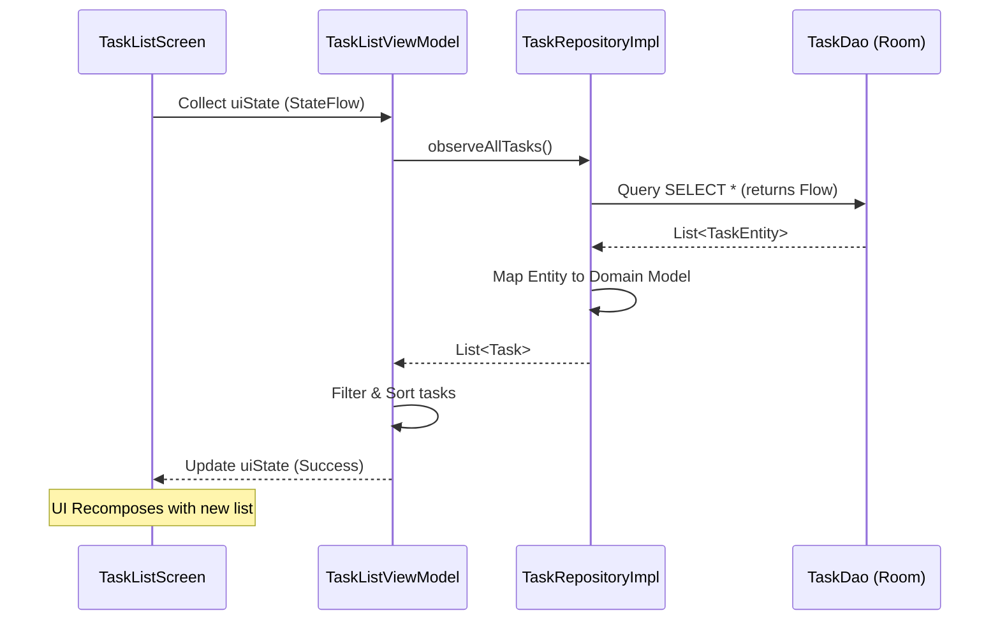
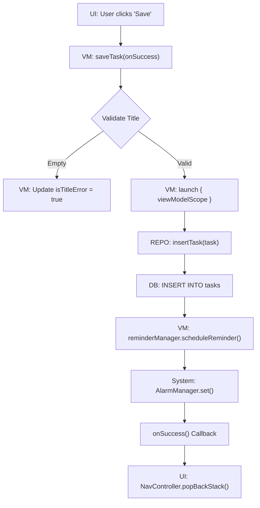
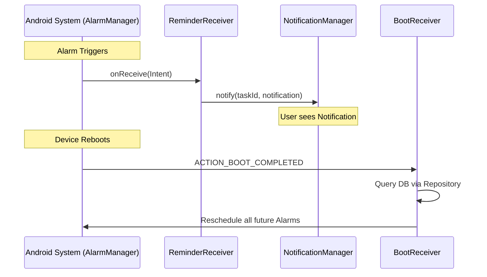

# 🌊 Architectural Data Flows

This document provides a visual roadmap of how data travels through the layers of the **Todo App**. Each diagram represents a specific use case, demonstrating **Unidirectional Data Flow (UDF)** and **Separation of Concerns**.

---

## 1. Fetching & Observing Tasks (The Reactive Loop)
**Goal**: Show a live list of tasks that updates automatically when the database changes.

### 🧠 Precise Explanation:
*   The UI never "asks" for data twice. It **observes** a stream.
*   The `Flow` originates in Room. When any part of the app writes to the `tasks` table, Room automatically emits a new list.
*   The Repository acts as a **translator**, converting database-specific objects into clean Kotlin models.

---

## 2. Creating a New Task (The Command Flow)
**Goal**: Save a user's input and trigger a system reminder.

### 🧠 Precise Explanation:
*   The **ViewModel** is the orchestrator. It decides if the data is "good enough" to be saved.
*   The **Repository** is the executor. It doesn't care about validation; it just fulfills the request to write to disk.
*   The **Reminder** is a side-effect. It happens only after a successful database write.

---

## 3. System Reminder & Notification (The External Flow)
**Goal**: Show a notification even if the app is closed or the phone was rebooted.

### 🧠 Precise Explanation:
*   This flow is **System-Driven**, not UI-driven.
*   The `ReminderReceiver` is short-lived; it wakes up, shows the notification, and dies.
*   The `BootReceiver` ensures **persistence**. Without it, all reminders are deleted when the power goes off.

---

## 🌍 Summary of Layer Responsibilities

| Layer | Responsibility | Analogy |
| :--- | :--- | :--- |
| **UI (Compose)** | Detect clicks, show strings | The Steering Wheel |
| **ViewModel** | Hold state, handle logic, validate | The Driver |
| **Domain (Models)** | Define what a "Task" is | The Map |
| **Data (Repo/Room)** | Read/Write to disk | The Engine |
| **System (Service/Receiver)** | Talk to Android OS | The Radio/Lights |
