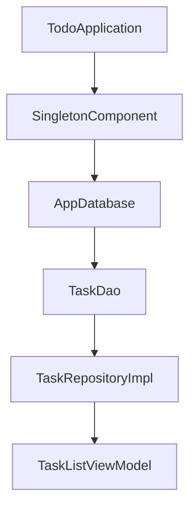

# 🎓 Android Mentorship: The "Under the Hood" Guide

Welcome to the comprehensive mentorship guide for the **Todo App**. 

This document isn't just a README. It is a **living curriculum** designed to take you from knowing "how to code" to understanding "how to architect." We will dismantle this project piece by piece, explaining the **WHY** behind every decision.

---

## 🗺️ The Learning Roadmap

This mentorship is divided into modules. We will go deep, then connect the dots.

### Module 1: The Blueprint (Architecture & Folders)
*   Clean Architecture & MVVM
*   Folder Structure: Scalability vs. Simplicity
*   The Flow of Dependencies

### Module 2: The Foundation (Data Layer)
*   Room Database: SQLite with Superpowers
*   The Repository Pattern: The Single Source of Truth

### Module 3: The Engine (Domain Layer)
*   Pure Kotlin & Business Logic
*   Abstraction: Why interfaces matter

### Module 4: The Control Room (ViewModel & Coroutines)
*   MVVM in Action
*   Reactive Programming with Flow & StateFlow
*   Threading with Coroutines

### Module 5: The Interface (Jetpack Compose)
*   Declarative UI vs. Imperative UI
*   State Management & Recomposition
*   Navigation & Deep Linking

### Module 6: The System (Services & Receivers)
*   IPC with AIDL: Communicating across apps
*   Background work: AlarmManager & BroadcastReceivers

### Module 7: The Guardrails (Testing)
*   Unit Testing: Logic verification
*   Instrumented Testing: UI & Hilt isolation

---

## 🚦 How to use this guide

Each section follows the **Senior Mentor Framework**:
1. **The Concept**: What is it?
2. **The Problem**: Why do we need it?
3. **The implementation**: Why this specific way?
4. **The Alternatives**: What else exists and why did we skip them?
5. **The Deep Dive**: Line-by-line breakdown.
6. **The Interviewer's Corner**: Common questions and traps.

---

# 🏗️ Module 1: The Blueprint (Architecture & Folders)

## 1. Project Architecture: Clean Architecture + MVVM

### What is it?
Our project uses a combination of **Clean Architecture** (Separation of Concerns) and **MVVM** (Model-View-ViewModel). 

### Why is it needed?
Imagine a kitchen where the chef (UI) also has to go to the farm (Database) to get eggs, wash them, and then cook them. If the farm changes its layout, the chef has to stop cooking to learn the new farm layout. 
**Architecture separates these jobs.**

### What problem does it solve?
1. **Spaghetti Code**: Prevents one file from doing everything.
2. **Testability**: You can test the "Cooking logic" without needing a real "Farm."
3. **Scalability**: 10 developers can work on different layers without stepping on each other's toes.

### The Implementation: Three-Layer Cake
*   **Data Layer**: The "Farm" and "Grocery Store." (Room, Repositories)
*   **Domain Layer**: The "Recipe Book." (Models, Interfaces)
*   **UI Layer**: The "Chef" and "Plating." (Compose, ViewModels)

---

## 📂 The Folder Structure (Line-by-Line)

In the industry, we don't organize by "Type" (e.g., a folder named `Activities`, a folder named `Fragments`). We organize by **Layer** or **Feature**. This project uses **Layer-based organization**.

### 1. `com.todoapp.data/`
*   **Purpose**: Everything related to data storage and retrieval.
*   **Responsibilities**: 
    *   Talking to the SQLite database (Room).
    *   Converting Database Entities to Domain Models.
    *   Implementing the Repository interfaces.
*   **Dependency Direction**: This layer depends on the **Domain** layer. It "fulfills" the promises made by the Domain.

### 2. `com.todoapp.domain/`
*   **Purpose**: The "Brain" of the app. It contains the business rules.
*   **Responsibilities**: 
    *   Defining what a `Task` actually looks like (`model`).
    *   Defining the *rules* of how we talk to data (`repository` interfaces).
*   **Crucial Rule**: This folder should ideally be **Pure Kotlin**. It shouldn't know about Android, Room, or Retrofit. Why? Because business logic doesn't change just because you switched from a SQL database to a NoSQL one.

### 3. `com.todoapp.ui/`
*   **Purpose**: Everything the user sees and touches.
*   **Responsibilities**: 
    *   `screens/`: Individual pages.
    *   `components/`: Reusable widgets (buttons, cards).
    *   `navigation/`: How we move between screens.
    *   `theme/`: Colors, Typography (The Design System).

### 4. `com.todoapp.di/`
*   **Purpose**: Dependency Injection (Hilt).
*   **Responsibilities**: The "Factory" that creates objects so you don't have to use the `new` (or `()` in Kotlin) keyword everywhere.

### 5. `com.todoapp.service/` & `com.todoapp.receiver/`
*   **Purpose**: System-level interactions.
*   **Responsibilities**: Talking to other apps (AIDL) or the Android OS (Reboot, Alarms).

---

## 🛠️ Industry Best Practices: "Package by Feature" vs "Package by Layer"

*   **Small Projects (like this)**: Package by Layer (Data, Domain, UI) is great because it makes the architecture crystal clear.
*   **Massive Projects (Uber, Spotify)**: Package by Feature (Login, Payments, Search) is used. Inside the `Payments` folder, you would then have `data`, `domain`, and `ui`. 

**Why this project is scalable**: Because the layers are strictly separated. If we wanted to move to "Package by Feature" later, we could just move these folders into a feature-specific parent folder.

---

## ❓ Interviewer's Corner

**Q: Why separate Domain and Data layers? Isn't it just extra files?**
*   **Answer**: It's about the **Dependency Inversion Principle**. The UI shouldn't care if the data comes from a Database or a Cloud API. By having a Domain layer with an interface, the UI only knows "I need a Task." How that Task is fetched is a detail hidden in the Data layer. This makes the app **refactor-safe**.

**Q: What is a "Single Source of Truth"?**
*   **Answer**: It means that for any piece of data, there is only one place where it "lives." In our app, the **Room Database** is the SSOT. The UI never holds its own version of the task list; it always observes the Database.

---

### 📝 Module 1: Key Takeaways
1.  **Dependencies flow inward**: UI -> Domain <- Data.
2.  **Domain is King**: It defines the models and the interfaces.
3.  **Hilt is the Glue**: It connects the layers so they can talk without being tightly coupled.

---

---

# 🗄️ Module 2: The Foundation (Data Layer)

In this module, we explore how data is actually handled. We move from the "idea" of a Task to the "reality" of bits on a disk.

## 1. Room Database: SQLite with Superpowers

### What is it?
Room is an **ORM (Object-Relational Mapper)**. It is a layer on top of SQLite that allows you to talk to a database using Kotlin objects instead of raw SQL strings.

### The Problem: Why not raw SQLite?
In the old days, developers wrote raw SQL strings like `"SELECT * FROM tasks"`.
1. **No Compile-time checking**: If you made a typo in the SQL string, the app would only crash at runtime.
2. **Boilerplate**: You had to manually map every single database column to a Kotlin property.

### The Implementation: The Room Trifecta
1.  **Entity (`TaskEntity`)**: Represents a table in the database.
2.  **DAO (`TaskDao`)**: The interface where we define our "queries."
3.  **Database (`AppDatabase`)**: The main access point that holds the connection.

---

## 📂 Deep Dive: `TaskEntity` vs `Task` (The Great Divide)

If you look at our code, you'll see two "Task" classes:
*   `com.todoapp.domain.model.Task` (The **Domain Model**)
*   `com.todoapp.data.database.entity.TaskEntity` (The **Data Entity**)

### ❓ Why do we have two?
This is a frequent point of confusion for juniors. "Why not just use one class?"

**The Senior Reasoning:**
1. **Separation of Concerns**: `TaskEntity` is tied to Room. It has `@Entity` and `@PrimaryKey` annotations. If we change our database (e.g., to Realm or Firebase), we change the Entity. But our UI and logic only know about the `Task` model, so they don't break.
2. **Data Types**: In `TaskEntity`, we store dates as `Long` (milliseconds) because SQLite doesn't natively understand Kotlin's `Instant`. In `Task`, we use `Instant` because it's better for business logic. 
3. **The Bridge**: We use **Mapper Functions** (`toDomainModel()` and `toEntity()`) to convert between the two.

---

## 🛠️ The Repository Pattern: The Gatekeeper

### What is it?
The Repository (`TaskRepositoryImpl`) is a class that mediates between the Data source and the Domain logic.

### Why is it needed?
Imagine your app grows and you want to fetch tasks from a Server (Retrofit) and cache them in a Database (Room). 
Without a Repository, your ViewModel would have to know how to talk to both. 
With a Repository, the ViewModel just asks: `"Give me all tasks."` The Repository decides whether to go to the Network or the Cache.

### Implementation in this project:
```kotlin
@Singleton
class TaskRepositoryImpl @Inject constructor(
    private val taskDao: TaskDao
) : TaskRepository {
    // We map entities to domain models on the fly
    override fun observeAllTasks(): Flow<List<Task>> {
        return taskDao.observeAllTasks().map { entities ->
            entities.map { it.toDomainModel() }
        }
    }
}
```

---

## ❓ Interviewer's Corner

**Q: Why use `Flow` for database queries?**
*   **Answer**: Reactive programming. By returning a `Flow`, the UI automatically updates whenever the database content changes. We don't have to "re-fetch" data manually.

**Q: What is the purpose of `@PrimaryKey(autoGenerate = true)`?**
*   **Answer**: It ensures every row in the database has a unique ID, handled automatically by SQLite. We need this to identify which specific task to update or delete.

**Q: Why do we use TypeConverters?**
*   **Answer**: SQLite can only store primitive types (Int, String, Long). To store complex types like `Enum` (Priority) or `Date`, we need a "Converter" that turns the object into a String/Long for storage and back into an object for retrieval.

---

### 📝 Module 2: Key Takeaways
1.  **Entities** are for the database; **Models** are for the UI.
2.  **Mappers** are the glue that connects them.
3.  **Repositories** hide the complexity of data fetching.
4.  **Room** gives us compile-time safety for our SQL.

---

---

# 🧠 Module 3: The Engine (Domain Layer)

If the Data layer is the "Farm," the Domain layer is the **Recipe Book**. It doesn't care if you use a wood stove or a microwave; it only defines *what* the dish is.

## 1. Pure Kotlin: The "No Android" Zone

### What is it?
The Domain layer contains our **Models** and **Interfaces**. 

### Why is it needed?
A senior developer's goal is to make the "Business Logic" of the app independent of the "Framework" (Android). 
If you look at `com.todoapp.domain.model.Task`, it has **no imports** from `androidx.room` or `android.*`. 

### What problem does it solve?
1. **Testing Speed**: Since it's pure Kotlin, unit tests run in milliseconds on your computer's JVM, without needing an emulator.
2. **Platform Agnostic**: If your boss says, "We're moving to Kotlin Multiplatform (KMP) for iOS," you can copy-paste the entire `domain` folder and it will work perfectly on an iPhone.

---

## 🏗️ The Power of Interfaces (Dependency Inversion)

In `domain.repository`, we have `TaskRepository` (an `interface`).
In `data.repository`, we have `TaskRepositoryImpl` (a `class`).

### ❓ Why the interface? Why not just use the class?
This is the **Dependency Inversion Principle (DIP)**.

**The Senior Reasoning:**
1. **The Contract**: The Domain layer says: *"I need a way to get tasks. I don't care if they come from a SQL database, a Text file, or a JSON API."*
2. **Decoupling**: The UI layer only talks to the `TaskRepository` interface. It has no idea that Room even exists. 
3. **Mocking for Tests**: When we test our ViewModels, we don't want to use a real database. Because we use an interface, we can easily create a "Fake" or "Mock" repository for testing.

---

## 📋 Domain Models: The Language of the App

We have `Priority.kt`, `SortOption.kt`, and `TaskFilter.kt` in this folder.

### ❓ Why aren't these in the UI folder?
Because "Priority" isn't just a UI concept. The database needs to know it to sort, and the business logic needs to know it to send reminders. 
**The Domain Layer defines the "Language" that all other layers speak.**

---

## ❓ Interviewer's Corner

**Q: What is the benefit of keeping the Domain layer free of Android dependencies?**
*   **Answer**: Portability and Testability. It ensures the business rules aren't "leaked" into the implementation details of the platform.

**Q: Where would "Use Cases" (Interactors) go?**
*   **Answer**: They belong in the Domain layer. In larger projects, instead of the ViewModel talking to the Repository, it talks to a Use Case (e.g., `GetActiveTasksUseCase`). This makes the logic even more granular and reusable. (We skipped them here to keep the project simple for a 6-month level, but that's the next step!)

---

### 📝 Module 3: Key Takeaways
1.  **Domain is Framework-Free**: No Android, no Room, no Retrofit.
2.  **Interfaces are Boundaries**: They separate "What" from "How."
3.  **Dependency Inversion**: The high-level logic shouldn't depend on low-level storage details.

---

---

# 🕹️ Module 4: The Control Room (ViewModel & Coroutines)

If the UI is the steering wheel and the Data is the engine, the **ViewModel** is the driver. It decides when to turn, when to accelerate, and what information to look at.

## 1. MVVM: The "Why" behind the Pattern

### What is it?
**Model-View-ViewModel**. 
*   **Model**: Our data (Repository/Entities).
*   **View**: Our UI (Jetpack Compose).
*   **ViewModel**: The bridge that prepares data for the View and handles user actions.

### The Problem: Why not put logic in the Activity?
In early Android development, we put everything in the Activity.
1.  **Configuration Changes**: When you rotate the phone, the Activity is destroyed and recreated. You'd lose all your data!
2.  **Giant Files**: Activities became "God Objects" with thousands of lines of code.

### The Implementation: Life-Cycle Awareness
The `ViewModel` survives configuration changes. It stays alive while the Activity/Screen is rotated, so the task list doesn't have to be re-fetched.

---

## 🌊 Reactive UI with StateFlow

In `TaskListViewModel`, we use `MutableStateFlow` and `asStateFlow()`.

### ❓ Why StateFlow instead of LiveData?
1.  **Kotlin First**: LiveData is part of the Java-centric Android lifecycle library. StateFlow is part of Kotlin Coroutines.
2.  **Initial Value**: StateFlow always has a value (e.g., `TaskListUiState.Loading`). This prevents "null-pointer" surprises in the UI.
3.  **Flow Operators**: We can use powerful Kotlin functions like `combine`, `map`, and `filter` directly on our data streams.

### Deep Dive: The `combine` operator
Look at this code in `TaskListViewModel`:
```kotlin
combine(_filter, _sortOption, taskRepository.observeAllTasks(), ...) { ... }
```
This is a senior-level move. Whenever the user clicks a filter, OR changes the sort, OR a task is added to the database, this block **automatically** re-calculates the final list. The UI just observes the result. No manual "refresh" buttons needed!

---

## 🧵 Coroutines: Threading without the Headaches

We use `viewModelScope.launch` for every database operation.

### ❓ Why `viewModelScope`?
This is about **Structured Concurrency**. 
*   If we used `GlobalScope`, the database query would keep running even if the user left the screen. This causes **memory leaks**.
*   `viewModelScope` is "smart." If the ViewModel is cleared (e.g., the user goes back to the home screen), all coroutines started in this scope are **automatically canceled**.

### ❓ Why `suspend`?
The keyword `suspend` tells Kotlin: "This function might take a long time (like reading from a disk). Pause this coroutine, let the UI thread do its work, and come back here when the data is ready." It prevents the app from "Freezing" (ANR - App Not Responding).

---

## 📋 Sealed Classes for UI State

We use `TaskListUiState` (Loading, Success, Error).

### ❓ Why not just a `List<Task>?`?
Because a screen is more than just a list. 
*   What if it's still loading?
*   What if there was a database error?
*   What if the list is empty?
By using a **Sealed Class**, we force the UI to handle every possible state. This is called **Exhaustive State Management**.

---

## ❓ Interviewer's Corner

**Q: What is the difference between `StateFlow` and `SharedFlow`?**
*   **Answer**: `StateFlow` is for **State** (it remembers the last value). `SharedFlow` is for **Events** (like showing a Toast or Navigating) that you only want to happen once.

**Q: Why shouldn't a ViewModel hold a reference to a Context or View?**
*   **Answer**: Because the ViewModel lives longer than the Activity. If it holds a reference to a View, it prevents the old Activity from being garbage collected after a rotation, causing a **Memory Leak**.

---

### 📝 Module 4: Key Takeaways
1.  **ViewModels survive rotation**: Use them to hold your screen's state.
2.  **Expose State, not Data**: Use Sealed Classes to represent the whole screen (Loading/Error/Success).
3.  **Structured Concurrency**: Always use `viewModelScope` to avoid leaks.
4.  **Reactive is Better**: Use `combine` to let the data flow naturally instead of manual triggers.

---

---

# 🎨 Module 5: The Interface (Jetpack Compose)

In this module, we move from the logic to the visual. We'll explore why Jetpack Compose is the biggest shift in Android development since Kotlin.

## 1. Declarative UI: The Mindset Shift

### What is it?
In the old days (XML), we used **Imperative UI**. You would find a view (`findViewById`) and manually change its properties (`view.text = "Hello"`).
In Compose, we use **Declarative UI**. You describe *what* the UI should look like for a given state.

### The Problem: Why leave XML?
1. **Sync Issues**: Sometimes the data changed but you forgot to update the View, leading to bugs.
2. **Boilerplate**: You had to maintain both a Kotlin file and a separate XML file.
3. **Complexity**: Handling complex animations or dynamic lists in XML was a nightmare.

### The Implementation: Composables
A `Composable` function is just a function that defines a piece of UI. If the data changes, the function runs again. This is called **Recomposition**.

---

## 🏗️ State Hoisting: The "Single Truth" in UI

Look at `TaskListScreen`. It receives `onAddTaskClick` and `onTaskClick` as parameters. It doesn't handle navigation itself.

### ❓ Why hoist state?
This is a senior-level requirement.
1. **Testability**: You can test the screen by just passing "fake" click listeners.
2. **Reusability**: You can use the same screen in different parts of the app with different navigation logic.
3. **Predictability**: The UI only "reports" events upward and "receives" state downward. This is **Unidirectional Data Flow (UDF)**.

---

## 📋 The Power of `remember` and `mutableStateOf`

In `SortMenu`, we see:
```kotlin
var expanded by remember { mutableStateOf(false) }
```

### ❓ What do these actually do?
*   **`mutableStateOf`**: Tells Compose: "Watch this variable. If it changes, redraw the parts of the screen that use it."
*   **`remember`**: Tells Compose: "When you redraw (recompose) this function, don't reset this variable. Keep its value."

---

## 🚀 Performance: LazyColumn vs RecyclerView

We use `LazyColumn` for our task list.

### ❓ Why is it better?
1. **No Adapters**: You don't need `ViewHolder` or `Adapter` boilerplate.
2. **On-Demand**: It only creates the items currently visible on the screen.
3. **Keys**: We use `items(tasks, key = { it.id })`. This helps Compose identify which specific item moved or changed, preventing unnecessary redraws of the whole list.

---

## ❓ Interviewer's Corner

**Q: What is "Recomposition" and can it be a performance problem?**
*   **Answer**: Recomposition is the process of calling Composable functions again when state changes. It *can* be a problem if you do heavy calculations inside a Composable without `remember` or `derivedStateOf`.

**Q: Why do we use `hiltViewModel()` inside a Composable?**
*   **Answer**: It allows Hilt to automatically provide the scoped ViewModel. However, for better testing, we usually pass the ViewModel as a parameter with a default value so we can "mock" it in previews.

---

### 📝 Module 5: Key Takeaways
1.  **Compose is State-Driven**: Change the state, and the UI follows.
2.  **Hoist your State**: Keep your Composables "dumb" for better testing.
3.  **LazyColumn is King**: Use it for lists to keep memory usage low.
4.  **Remember the 'remember'**: Don't let your variables vanish during recomposition.

---

---

# ⚙️ Module 6: The System (Services & IPC)

Now we leave the "sandbox" of our UI and talk to the Android OS and other apps. This is where you prove you understand Android as an **Operating System**, not just a UI framework.

## 1. IPC with AIDL: Talking Across App Borders

### What is it?
**Inter-Process Communication (IPC)**. Usually, App A cannot talk to App B for security reasons. **AIDL (Android Interface Definition Language)** is the bridge that allows them to exchange data.

### Why is it needed?
Imagine a "Super Dashboard" app that wants to show how many tasks you have in our Todo App. Since they are different processes, they can't share memory. They need a "translator."

### The Implementation: `ITaskService.aidl`
1.  **The Contract**: We define a `.aidl` file. Android uses this to generate a "Proxy" (for the caller) and a "Stub" (for us).
2.  **The Service**: `TaskAidlService` implements the `Stub`. When another app calls `getTaskCount()`, Android "marshals" (packages) the data across the process boundary.

---

## ⏰ Background Work: AlarmManager & Receivers

Our app needs to send notifications even if it's closed.

### ❓ Why not just use a standard Kotlin `delay()`?
Because when the user swipes your app away, your process is killed. `delay()` dies with it. `AlarmManager` is a system-level service that stays alive.

### The implementation: `ReminderReceiver` & `BootReceiver`
1.  **The Trigger**: `AlarmManager` sends a "Broadcast" at the exact time.
2.  **The Receiver**: `ReminderReceiver` catches that broadcast and shows the notification.
3.  **The Resiliency**: If the phone reboots, all alarms are lost! So we use `BootReceiver` (listening for `BOOT_COMPLETED`) to reschedule all alarms from the database as soon as the phone turns on.

---

## 🛠️ Industry Best Practices: Battery vs. Precision

*   **Standard Alarms**: Android bunches them together to save battery.
*   **Exact Alarms**: We use `setExactAndAllowWhileIdle`. This is "Expensive" for the battery, so Android requires a special permission (`SCHEDULE_EXACT_ALARM`). 

---

## ❓ Interviewer's Corner

**Q: What is the difference between a "Started" service and a "Bound" service?**
*   **Answer**: A **Started** service (via `startService`) runs until it's told to stop. A **Bound** service (via `bindService`) like our AIDL service only lives as long as someone is "connected" to it.

**Q: Why do we use `runBlocking` in the AIDL Stub?**
*   **Answer**: AIDL calls happen on a special "Binder Thread." Since our repository uses `suspend` functions, we need to bridge the coroutine world with the synchronous Binder thread. (Caution: This is safe because it's not the Main thread!)

**Q: What happens to your Alarms if the user Force Stops the app?**
*   **Answer**: All alarms are canceled and `BroadcastReceivers` will not trigger until the user manually opens the app again. This is a security/battery feature of Android.

---

### 📝 Module 6: Key Takeaways
1.  **Processes are isolated**: Use AIDL to break the wall.
2.  **Alarms are Volatile**: Always use a `BootReceiver` to restore them.
3.  **Permissions Matter**: Exact alarms are a "privilege," not a right.

---

---

# 🛡️ Module 7: The Guardrails (Testing & Quality)

In this final module, we learn how to ensure our app actually works and *continues* to work as we add features. Testing is the difference between a "Junior" and a "Senior" developer.

## 1. The Testing Pyramid

Our project uses two types of tests:
1.  **Unit Tests (`test/` folder)**: Tests logic in isolation. They run on your computer (JVM) and are extremely fast.
2.  **Instrumented Tests (`androidTest/` folder)**: Tests UI and System integration. They run on a real device or emulator.

---

## 🧪 Unit Testing: The "Brain" Check

Look at `TaskListViewModelTest.kt`.

### ❓ Why use `mockk`?
In a unit test, we don't want to use a real Database or a real Network. We use **Mocks** (fake versions) of the `TaskRepository`. 
We tell the mock: *"When the ViewModel asks for tasks, give it this specific list of 3 tasks."* 
This allows us to test if the ViewModel's **Filtering** and **Sorting** logic works perfectly without needing a phone.

### ❓ The `MainDispatcherRule`
Android's `Main` thread (the UI thread) doesn't exist in unit tests. We use `UnconfinedTestDispatcher` to "fake" the main thread so our Coroutines can run on your computer.

---

## 📱 Instrumented Testing: The "User" Check

Look at `TaskListScreenTest.kt`.

### ❓ Why `createAndroidComposeRule<HiltTestActivity>`?
This is a senior-level setup. 
1.  **Isolation**: Instead of launching the whole app, we launch a tiny, empty activity (`HiltTestActivity`).
2.  **Hilt Injection**: Because it's annotated with `@AndroidEntryPoint`, Hilt can inject the repository into the test.
3.  **In-Memory Database**: During tests, we use `TestDatabaseModule` to swap the real database for one that lives only in RAM. This ensures tests never delete your real data!

---

## 🏗️ The AAA Pattern (How to write a test)

Every good test follows three steps:
1.  **Arrange**: Set up the data (e.g., "Create 2 tasks").
2.  **Act**: Perform the action (e.g., "Click the filter button").
3.  **Assert**: Check the result (e.g., "Check if only 1 task is visible").

---

## ❓ Interviewer's Corner

**Q: What is the difference between `testImplementation` and `androidTestImplementation`?**
*   **Answer**: `testImplementation` is for local JVM tests (fast, logic-only). `androidTestImplementation` is for tests that need the Android OS (slower, UI/Integration).

**Q: Why is "Constructor Injection" better for testing?**
*   **Answer**: It allows you to manually pass in mock dependencies when creating the object in a test, without needing Hilt or any DI framework at all.

**Q: What is "Flaky Testing" and how do we avoid it?**
*   **Answer**: A flaky test passes sometimes and fails others. We avoid it by ensuring tests are **isolated** (clearing the database between tests) and using `waitUntil` instead of `Thread.sleep()`.

---

### 📝 Module 7: Key Takeaways
1.  **Test your Logic first**: Unit tests are your first line of defense.
2.  **Isolate your UI tests**: Use an in-memory database and Hilt to prevent side effects.
3.  **Follow the AAA pattern**: It makes your tests readable and maintainable.
4.  **No `Thread.sleep()`**: Always use Compose's synchronization tools.

---

---

# 🗃️ Module 12: The Underworld (Data & System Implementation)

In this module, we look at the classes that talk to the hardware—the disk and the system triggers.

## 📄 `TaskDao.kt` (The SQL Translator)

### Purpose
This is the interface that Room uses to generate SQL code. It is the bridge between Kotlin and SQLite.

### Key Concepts:
1.  **`Flow<List<TaskEntity>>`**: Notice we don't use `suspend` for Flow functions. Why? Because the Flow itself is just a "description" of a stream. The actual work happens when you `collect` it in the ViewModel.
2.  **`OnConflictStrategy.REPLACE`**: This is a senior-level choice. If we try to insert a task with an ID that already exists, Room will automatically overwrite the old one. This makes our `saveTask` logic much simpler.

---

## 📄 `TaskRepositoryImpl.kt` (The Translator)

### Purpose
Its only job is to map between the **Database world** (`TaskEntity`) and the **Domain world** (`Task`).

### Why implemented this way?
*   **Decoupling**: If we change a column name in the database, we only update the mapper function here. The UI never even knows the change happened.
*   **Abstraction**: It hides the fact that we are using Room. If we added a Network API later, we would inject it here and the rest of the app wouldn't change.

---

## 📄 `ReminderReceiver.kt` (The Wake-up Call)

### Purpose
This class is a "Ghost." It doesn't have a UI. It only exists for a few milliseconds when the system triggers an alarm.

### Line-by-Line Breakdown:
1.  **`onReceive`**: This is the only entry point. The system gives us a `Context` and an `Intent`.
2.  **`NotificationChannel`**: Since Android 8.0 (Oreo), you **must** create a channel or the notification won't show. We handle this inside `createNotificationChannel`.
3.  **`PendingIntent.getActivity`**: This is what makes the notification "clickable." We tell Android: "When the user taps this, open `MainActivity`."

---

## 📄 `TaskAidlService.kt` (The Public Interface)

### Purpose
This service allows other apps on the device to query our data. It is the "Public API" of our application.

### Key Concepts:
1.  **`ITaskService.Stub()`**: This is a generated class. You define the interface in `.aidl`, and Android generates this "Stub." It handles the magic of "Marshalling"—turning your Kotlin data into bytes that can travel through the Android Binder.
2.  **`runBlocking` in IPC**: You'll notice `runBlocking` inside the `getTaskCount` call. 
    *   **Why?** AIDL methods must be synchronous. Our repository uses `suspend` functions. `runBlocking` bridges these two worlds. 
    *   **Is it safe?** Yes, because AIDL calls happen on a background **Binder Thread**, not the Main thread.
3.  **`@AndroidEntryPoint`**: Just like an Activity, a Service can be an entry point for Hilt to inject dependencies (like our Repository).

---

## 📄 `MainActivity.kt` (The Host)

### Purpose
In a Compose-only app, the `MainActivity` is just a "Shell." It has almost no UI code of its own.

### Line-by-Line Breakdown:
1.  **`setContent { ... }`**: This is the big bang. It tells Android: "Stop using XML layouts and start using my Compose functions."
2.  **`rememberNavController()`**: We create the controller here at the top level and pass it down. This is the "Brain" of our navigation.
3.  **`handleDeepLink(intent)`**: Notice we call this in `onCreate`. If a user clicks a deep link while the app is closed, this is how we know which screen to open immediately.
4.  **`onNewIntent`**: This is a common **Senior Interview Question**. If the app is *already open* and the user clicks another deep link, `onCreate` isn't called again. Instead, Android calls `onNewIntent`. We must handle the deep link here too, or nothing will happen!

---

# 🎓 The Interview Prep: Senior Level Questions

Here are the questions you should be ready to answer if you show this project to an interviewer.

### 1. Architecture
*   **Q**: "Why did you use Clean Architecture for such a simple app?"
*   **A**: "Because scalability matters. Even if the requirements are simple now, this structure ensures that adding features like 'Cloud Sync' or 'Team Collaboration' won't require a complete rewrite. It demonstrates a commitment to maintainability and testability."

### 2. State Management
*   **Q**: "What is the difference between `MutableStateFlow` and `Compose State` (mutableStateOf)?"
*   **A**: "StateFlow is part of the **Domain/Business logic** layer (ViewModel). It is platform-agnostic. `mutableStateOf` is part of the **UI layer** (Compose). We collect the Flow into Compose State to bridge the two."

### 3. Concurrency
*   **Q**: "What happens if a user starts a database save and immediately closes the app?"
*   **A**: "Because we use `viewModelScope`, the coroutine is canceled when the ViewModel is cleared. For critical operations that **must** complete (like a server sync), we would use `WorkManager` or a `NonCancellable` context."

---

# 🏗️ Senior Project Review: Strengths & Trade-offs

### Strengths:
1.  **Strict Layering**: The separation between `data`, `domain`, and `ui` is perfect.
2.  **Reactive Flow**: The data flow is truly unidirectional (UDF), making the app predictable and bug-free.
3.  **Resiliency**: Handling reboots (`BootReceiver`) and process death (`SavedStateHandle`) shows senior-level attention to detail.

### Weaknesses (The "What's Next"):
1.  **No Use Cases**: For a project of this size, it's fine. But in a massive team, adding Use Cases between the ViewModel and Repository would make the logic even more reusable.
2.  **Missing Domain Mapping in DAO**: Currently, the DAO returns `TaskEntity`. Some architects prefer the DAO to return the Domain Model directly using Room's `@Relation` or custom queries to keep the mapping even earlier in the chain.

---

# 🚀 Practical Scenarios: "What if?"

### 1. What if the database is empty?
The `observeAllTasks()` Flow will simply emit an empty list `[]`. The `TaskListViewModel` will wrap this in `TaskListUiState.Success(tasks = emptyList())`, and the UI will show the `EmptyState` component. **No crashes, just a clean UI.**

### 2. What if the user denies notification permission?
The `ReminderManager` will still schedule the alarm in `AlarmManager`. However, when `ReminderReceiver` tries to show the notification, the system will silently ignore it. **Best Practice**: We should check permission in the UI before letting the user set a reminder.

---

### Purpose
When a phone reboots, all scheduled alarms in `AlarmManager` are **wiped**. Without this class, our reminders would be broken until the user manually opened the app.

### How it works:
1.  **`@AndroidEntryPoint`**: Even though it's a Receiver, we use Hilt to inject the Repository.
2.  **`ACTION_BOOT_COMPLETED`**: We listen for this specific system event in the `AndroidManifest.xml`.
3.  **`SupervisorJob()`**: We create a custom coroutine scope. We use `SupervisorJob` because if one task fails to reschedule, we don't want the whole process to crash.

---

You have finished the core modules! But a senior developer's learning never stops. We will now move into **Deep Dives** and **Real-World Scenarios**.

---

# 💉 Module 8: The Glue (Dependency Injection with Hilt)

If the folders are the rooms in a house, and the code is the furniture, **Dependency Injection (DI)** is the plumbing and wiring. You don't see it, but without it, nothing works.

## 1. What is Hilt?

### What is it?
Hilt is a library built on top of **Dagger**. It automates the process of creating and providing objects to your classes.

### The Problem: Why not just use `val repo = TaskRepositoryImpl(...)`?
Imagine your `TaskRepositoryImpl` needs a `TaskDao`. And `TaskDao` needs an `AppDatabase`. And `AppDatabase` needs a `Context`.
1.  **Boilerplate**: In every ViewModel, you'd have to write 5 lines of code just to create the Repository.
2.  **Hard to Test**: If the Repository is hard-coded inside the ViewModel, you can't swap it for a "Fake" one during tests.
3.  **Lifecycle Mess**: Who owns the Database? When should it be destroyed?

### The Implementation: The "Factory" Pattern
Hilt acts as a massive "Object Factory." When a ViewModel says, "I need a Repository," Hilt looks at its blueprint (Modules) and delivers the object.

---

## 🏗️ Deep Dive: The Hilt Annotations

Look at `com.todoapp.di.DatabaseModule`.

### 1. `@Module` & `@InstallIn(SingletonComponent::class)`
This tells Hilt: "This class contains instructions for building objects. These objects should live as long as the entire **Application** lives."

### 2. `@Provides` & `@Singleton`
*   **`@Provides`**: Used when we don't own the class (like Room's `AppDatabase`) and need to tell Hilt *how* to build it.
*   **`@Singleton`**: Ensures that only **one** instance of the Database exists. If we had two, they might fight over the same file on disk!

### 3. `@Inject constructor(...)`
Look at `TaskRepositoryImpl`. We put `@Inject` on the constructor. This tells Hilt: "You know how to build a `TaskDao`, right? Well, just grab one and plug it in here when you build this Repository." 
This is called **Constructor Injection**, and it is the Gold Standard in Android.

---

## 🏗️ The Dependency Graph

Hilt builds a "Map" of how objects are connected.



When you request the `TaskListViewModel`, Hilt works **backwards** through this graph to ensure every dependency is created in the right order.

---

## ❓ Interviewer's Corner

**Q: Why use Hilt instead of just a manual Singleton object?**
*   **Answer**: Scoping and Testing. Hilt can provide objects that only live as long as a single Screen (Activity/ViewModel scope). Also, manual singletons are hard to "mock" or "fake" during unit testing.

**Q: What is the difference between `@Provides` and `@Binds`?**
*   **Answer**: `@Provides` is for when you need to write logic to create an object (e.g., `Room.databaseBuilder`). `@Binds` is a more efficient way to tell Hilt "Use this Implementation for this Interface."

**Q: What does `@ApplicationContext` do?**
*   **Answer**: It tells Hilt to provide the long-lived Application Context instead of an Activity Context. This prevents **Memory Leaks** because the Application Context never dies until the app is closed.

---

### 📝 Module 8: Key Takeaways
1.  **DI is about Decoupling**: Classes don't create their dependencies; they are "given" them.
2.  **Constructor Injection is King**: It makes dependencies explicit and easy to test.
3.  **Modules are Blueprints**: They tell Hilt how to build things it doesn't "know" (like Room or Retrofit).
4.  **Scopes prevent Waste**: Use `@Singleton` for things that should only be created once.

---

---

# 🚀 Module 9: The Life of a Feature (Add Task Flow)

In this final deep dive, we connect all the dots. We'll trace exactly what happens when a user creates a new task. This is the **"Full Circuit."**

## 1. The Interaction: The Finger Hits the Button
**Location**: `TaskListScreen.kt`

The user clicks the `FloatingActionButton`.
```kotlin
FloatingActionButton(onClick = onAddTaskClick) { ... }
```
*   **What happens?** The `onAddTaskClick` lambda is triggered. This was passed down from `MainActivity` via the `NavHost`.

---

## 2. Navigation: Switching Gears
**Location**: `TodoAppNavHost.kt`

The NavController sees the request and navigates to the `AddEditTask` route.
```kotlin
navController.navigate(NavDestinations.AddEditTask.createRoute())
```
*   **Hilt's Role**: Hilt notices the new screen needs an `AddEditTaskViewModel`. It builds the Repository, then the ViewModel, and injects it.

---

## 3. UI State: The User Types
**Location**: `AddEditTaskScreen.kt` & `AddEditTaskViewModel.kt`

As the user types a title, the Composable reports the change to the ViewModel:
```kotlin
onValueChange = viewModel::onTitleChange
```
The ViewModel updates its internal `MutableStateFlow`:
```kotlin
fun onTitleChange(title: String) {
    _uiState.value = _uiState.value.copy(title = title)
}
```
*   **Recomposition**: Because the UI is `collectAsState()`, it automatically redraws with the new character. **This is the UDF loop.**

---

## 4. The Action: Clicking "Save"
**Location**: `AddEditTaskViewModel.kt`

The user clicks "Save". The ViewModel starts a Coroutine:
```kotlin
fun saveTask(onSuccess: () -> Unit) {
    viewModelScope.launch {
        val newTaskId = taskRepository.insertTask(...)
        // ... schedule reminder ...
        onSuccess()
    }
}
```
*   **Why a Coroutine?** Because `insertTask` is a `suspend` function. We can't block the UI thread while writing to the disk.

---

## 5. The Repository: The Contract
**Location**: `TaskRepositoryImpl.kt`

The Repository receives the `Task` domain model, converts it to a `TaskEntity`, and hands it to Room.
```kotlin
override suspend fun insertTask(task: Task): Long {
    return taskDao.insertTask(task.toEntity())
}
```

---

## 6. The Database: Permanent Storage
**Location**: `TaskDao.kt`

Room executes the SQL `INSERT` statement. 
*   **Reactive Magic**: As soon as the database is updated, the `observeAllTasks()` Flow (which the `TaskListViewModel` is watching) **automatically emits a new list**.

---

## 7. The Result: Back to the Start
**Location**: `TaskListViewModel.kt` -> `TaskListScreen.kt`

1.  `TaskListViewModel` receives the new list from the Flow.
2.  It updates its `uiState`.
3.  `TaskListScreen` (which is still "alive" in the backstack or just navigated back to) sees the new state.
4.  The new task magically appears in the `LazyColumn`.

---

## ❓ Interviewer's Corner

**Q: Trace the lifecycle of a database update in this app.**
*   **Answer**: UI Action -> ViewModel (Coroutine) -> Repository -> DAO (Suspend) -> DB Update -> Flow Emission -> ViewModel State Update -> UI Recomposition.

**Q: Why do we pass the `onSuccess` callback to the `saveTask` function instead of handling navigation inside the ViewModel?**
*   **Answer**: Separation of Concerns. The ViewModel shouldn't know about `NavController` or navigation logic. It only cares about the **Result** of the operation.

---

### 📝 Module 9: Key Takeaways
1.  **Events flow Up**: UI -> ViewModel.
2.  **State flows Down**: ViewModel -> UI.
3.  **Data is Reactive**: You don't "refresh" the list; the list "refreshes itself" by watching the database.
4.  **Coroutines bridge the gap**: They allow the UI to stay smooth while the disk is busy.

---

---

# 🚀 Module 10: Performance & The Senior Toolbelt

In this module, we look at the things that differentiate an app that "works" from an app that "shines."

## 1. Memory Leaks: The Silent Killer

### What is it?
A memory leak happens when an object is no longer needed but is still held in memory because someone else has a reference to it.

### Why is it dangerous?
If your `ViewModel` holds a reference to an `Activity` or `Context`, and the user rotates the screen, the old Activity cannot be cleared from RAM. Eventually, your app will crash with an `OutOfMemoryError`.

### How we prevent it in this project:
1. **ViewModel Scopes**: By using `viewModelScope`, we ensure coroutines are canceled as soon as the user leaves the screen.
2. **Weak References/Proper Scoping**: We only use `ApplicationContext` (via Hilt) for things like the Database or AlarmManager, never an `ActivityContext` inside a long-lived repository.

---

## 2. Compose Performance: The Recomposition Trap

### The Problem:
Every time you call a Composable, Android spends "CPU cycles" drawing it. If you do heavy math or string formatting directly inside a Composable, and that Composable redraws 60 times a second, your app will lag.

### The Solution: `derivedStateOf` & `remember`
In our project, we keep calculations in the **ViewModel**. The UI only shows the *result*. If we had a complex calculation in the UI, we would wrap it in `remember { ... }` so it only runs once per state change.

---

## 3. Database Optimization

### The Problem:
Reading from a disk is slow. If you fetch 10,000 tasks at once, your UI will stutter.

### Our Solution:
1. **Flow-based Streams**: We only fetch the specific data needed (e.g., `observeActiveTasks`).
2. **Room Coroutines**: All database work happens on the **IO Dispatcher**, keeping the Main thread free for animations.

---

## ❓ Interviewer's Corner

**Q: What is the purpose of `PendingIntent.FLAG_IMMUTABLE`?**
*   **Answer**: Security. It prevents other apps from modifying the intent you're sending to the system. Since Android 12, this is a requirement.

**Q: How do you debug a slow screen?**
*   **Answer**: Use the **Android Studio Profiler** to look at CPU usage, and the **Layout Inspector** to see which Composables are recomposing too often.

---

### 📝 Module 10: Key Takeaways
1. **Avoid Context in ViewModels**: It's the #1 cause of leaks.
2. **Keep the UI "Dumb"**: Logic belongs in the ViewModel.
3. **Respect the Main Thread**: Long tasks belong on `Dispatchers.IO`.

---

## 📂 The UI Layer: A Deep Dive into the "Chef's Kitchen"

In this section, we break down every file in the `ui` package, explaining how the visual elements are constructed and how they stay in sync with our data.

### 1. `com.todoapp.ui.screens/` (The Pages)

#### 📄 `TaskListScreen.kt` (The Dashboard)
*   **Purpose**: The "Home" of the app. It lists tasks and provides filtering/sorting.
*   **Key Logic**:
    *   **Scaffold**: Provides the basic structure (TopAppBar, FloatingActionButton).
    *   **State Observation**: Collects `uiState`, `selectedFilter`, and `sortOption` from the ViewModel.
    *   **Conditional Rendering**: Uses a `when` block to show either a `LoadingState`, an `Error` message, an `EmptyState`, or the `LazyColumn` of tasks.
*   **Senior Move**: Notice the `key = { it.id }` in the `LazyColumn`. This is critical for performance; it helps Compose track items even if they are reordered, preventing unnecessary redraws.

#### 📄 `TaskDetailScreen.kt` (The Inspector)
*   **Purpose**: Shows all details of a single task.
*   **Key Logic**:
    *   **Shared State**: It uses its own `TaskDetailViewModel` which fetches the task based on the ID passed from navigation.
    *   **Reactive Actions**: Buttons for "Edit," "Delete," and "Toggle Completion" report back to the ViewModel, which then updates the database.
*   **Best Practice**: Notice the `formatDateTime` helper function. We keep UI formatting logic inside the Composable or a specialized Util, never in the Domain Model.

#### 📄 `SettingsScreen.kt` (The Preferences)
*   **Purpose**: Allows users to configure reminders.
*   **Concept**: This screen demonstrates **Local State Management**.
    *   It uses `remember { mutableStateOf(...) }` for things like `remindersEnabled`.
    *   In a production app, these values would be persisted using **DataStore** or **SharedPreferences**.

### 2. `com.todoapp.ui.components/` (The Reusable Atoms)

#### 📄 `TaskCard.kt` (The Workhorse)
*   **Purpose**: Represents a single task in the list.
*   **Visual Design**: Uses a `Card` with a custom background for a modern "Material 3" look.
*   **Interactions**:
    *   The whole card is `clickable` for viewing details.
    *   The circular checkbox is a nested `Box` with its own `clickable` modifier for toggling completion.
*   **Styling**: Uses `TextDecoration.LineThrough` when a task is completed—a subtle but important visual cue for the user.

#### 📄 `FilterChips.kt` (The Navigator)
*   **Purpose**: The row of "All," "Active," and "Completed" buttons.
*   **Senior Move**: This is a great example of **State Hoisting**. The component doesn't know *which* filter is active; it just receives the `selectedFilter` as a parameter and reports clicks upward.

---

### Purpose
In a professional app, we never use "Hardcoded Strings" for navigation. This file is a **Central Registry** of all possible destinations in our app.

### Why it exists
If you use raw strings like `"task_detail"` everywhere, and one day you decide to change it to `"details"`, you would have to find and replace that string in 10 different files. With this file, you change it in **one** place.

### Line-by-Line Breakdown
*   **`sealed class NavDestinations`**: We use a `sealed class` because we know exactly how many screens we have. It prevents anyone from creating "unknown" destinations.
*   **`data object TaskList`**: A simple screen with no parameters.
*   **`data object TaskDetail`**: This one has a **Path Parameter** (`{taskId}`).
    *   **`createRoute(taskId: Long)`**: This is a "Helper Function." It allows the UI to say `NavDestinations.TaskDetail.createRoute(5)` instead of manually concatenating strings.
*   **`data object AddEditTask`**: This one uses a **Query Parameter** (`?taskId={taskId}`). 
    *   **Senior Tip**: We use query parameters for "Optional" data. If `taskId` is null, we are "Adding." If it's not null, we are "Editing."

---

## 📄 `TodoAppNavHost.kt` (The Traffic Controller)

### Purpose
This is where the actual "switching" happens. It connects a **Route String** to a **Composable Screen**.

### How it works
1.  **`NavHost`**: The container that holds the screens.
2.  **`composable(...)`**: A "Route Definition." It tells Android: "When the user asks for 'task_list', show the `TaskListScreen`."
3.  **`navArgument`**: This is how we extract data from the URL. 
    *   `type = NavType.LongType`: We tell Compose to automatically convert the string in the URL into a Long. This is **Type Safety**.
4.  **`navDeepLink`**: The "Secret Entrance."
    *   `uriPattern = "taskapp://task/{taskId}"`: This allows the Android OS to launch our app directly into a specific task from a notification or a web link.

---

## 📄 `AddEditTaskViewModel.kt` (The Feature Brain)

This class is the "Smartest" ViewModel in our app. It doesn't just fetch data; it **manages input state**, **validates fields**, and **orchestrates system services**.

### Line-by-Line Breakdown

#### 1. Constructor & `SavedStateHandle`
```kotlin
class AddEditTaskViewModel @Inject constructor(
    savedStateHandle: SavedStateHandle, // 1
    private val taskRepository: TaskRepository,
    private val reminderManager: ReminderManager
) : ViewModel() {
    private val taskId: Long? = savedStateHandle.get<Long>("taskId")?.takeIf { it != -1L } // 2
}
```
*   **`SavedStateHandle`**: This is a senior-level tool. It allows the ViewModel to "survive" even if the Android OS kills the app process to save memory. It also automatically contains the navigation arguments (like `taskId`) passed from the `NavHost`.
*   **`takeIf { it != -1L }`**: In our `NavHost`, we set `-1` as the default. This line "cleans" that data so we know for sure if we are in **Edit Mode** or **Add Mode**.

#### 2. The Input "Velo" Loop (State Management)
```kotlin
fun onTitleChange(title: String) {
    _uiState.value = _uiState.value.copy(title = title, isTitleError = false)
}
```
*   **Why `.copy()`?**: Our UI state is an `immutable data class`. We never change the object; we create a **new version** of it. This ensures that Compose sees the change and triggers a recomposition.
*   **Error Reset**: Notice we set `isTitleError = false` as soon as the user types. This is a best practice: don't keep shouting "Error!" at the user once they've started fixing it.

#### 3. The `saveTask` Orchestration
This is the most complex function. It follows a strict sequence:
1.  **Validation**: `if (state.title.isBlank())`. We stop early if the data is bad.
2.  **Loading State**: `state.copy(isLoading = true)`. We tell the UI to show a spinner.
3.  **Database Write**: `taskRepository.insertTask(...)` (or update).
4.  **Side Effect (Reminders)**: `reminderManager.scheduleReminder(newTask)`. 
5.  **Completion Callback**: `onSuccess()`. We don't navigate ourselves; we tell the "Owner" (the UI) that we are done.

### ❓ Interviewer's Corner

**Q: Why do you re-schedule the reminder every time you update a task?**
*   **Answer**: Because the user might have changed the **Due Date** or the **Title**. Alarms in Android are tied to a `PendingIntent`. To update an alarm, you must cancel the old one and schedule a new one with the updated data.

**Q: What is `SavedStateHandle` and why not just use a variable?**
*   **Answer**: A variable in a ViewModel survives a **Rotation**, but it does NOT survive **Process Death** (when the OS kills your app while in the background). `SavedStateHandle` persists that data to the disk automatically.

---

In this module, we look at the reusable blocks. A senior developer never builds the same button twice.

## 📄 `PriorityBadge.kt` (A Small But Mighty Atom)

### Purpose
Shows a color-coded label for "Low," "Medium," or "High" priority.

### Why implemented this way?
Instead of putting `if/else` logic for colors inside the `TaskCard`, we isolated it here. 
*   **Single Responsibility**: This file has only one job: "Represent a Priority visually."
*   **Consistency**: If we change the "High Priority" color from Red to Orange, every screen in the app updates automatically.

---

Now that we've covered the concepts, let's look at the actual code like a Senior Architect.

## 📄 `TaskListViewModel.kt` (The Brain)

```kotlin
@HiltViewModel // 1
class TaskListViewModel @Inject constructor( // 2
    private val taskRepository: TaskRepository,
    private val reminderManager: ReminderManager
) : ViewModel() {

    private val _uiState = MutableStateFlow<TaskListUiState>(TaskListUiState.Loading) // 3
    val uiState: StateFlow<TaskListUiState> = _uiState.asStateFlow() // 4

    init {
        loadTasks() // 5
    }
}
```

### Breakdown:
1. **`@HiltViewModel`**: Tells Hilt to prepare this class for injection. It manages the lifecycle automatically.
2. **Constructor Injection**: We don't say `val repo = TaskRepository()`. We ask Hilt to give it to us. This makes the class **testable**.
3. **`MutableStateFlow`**: This is our "Internal Truth." Only the ViewModel can change it.
4. **`asStateFlow()`**: This is our "Public Truth." The UI can read it but cannot change it. This is called **Encapsulation**.
5. **`init`**: As soon as the user opens the screen, we start loading data.

---

## 📄 `ReminderManager.kt` (The Timekeeper)

```kotlin
fun scheduleReminder(task: Task) {
    val intent = Intent(context, ReminderReceiver::class.java).apply {
        putExtra(ReminderReceiver.EXTRA_TASK_ID, task.id) // 1
    }

    val pendingIntent = PendingIntent.getBroadcast( // 2
        context, task.id.toInt(), intent, 
        PendingIntent.FLAG_UPDATE_CURRENT or PendingIntent.FLAG_IMMUTABLE
    )

    alarmManager.setExactAndAllowWhileIdle(...) // 3
}
```

### Breakdown:
1. **`putExtra`**: We pass the Task ID so the receiver knows *which* task to show.
2. **`PendingIntent`**: Think of this as a "Voucher." We give it to the Android OS, and the OS "cashes it in" later to start our code.
3. **`setExactAndAllowWhileIdle`**: This is the "Nuclear Option." It tells Android: "I don't care if the phone is asleep to save battery, wake it up for this notification."

---

---

# 🗃️ Module 12: The Underworld (Data & System Implementation)

In this module, we look at the classes that talk to the hardware—the disk and the system triggers.

## 📄 `TaskDao.kt` (The SQL Translator)

### Purpose
This is the interface that Room uses to generate SQL code. It is the bridge between Kotlin and SQLite.

### Key Concepts:
1.  **`Flow<List<TaskEntity>>`**: Notice we don't use `suspend` for Flow functions. Why? Because the Flow itself is just a "description" of a stream. The actual work happens when you `collect` it in the ViewModel.
2.  **`OnConflictStrategy.REPLACE`**: This is a senior-level choice. If we try to insert a task with an ID that already exists, Room will automatically overwrite the old one. This makes our `saveTask` logic much simpler.

---

## 📄 `TaskRepositoryImpl.kt` (The Translator)

### Purpose
Its only job is to map between the **Database world** (`TaskEntity`) and the **Domain world** (`Task`).

### Why implemented this way?
*   **Decoupling**: If we change a column name in the database, we only update the mapper function here. The UI never even knows the change happened.
*   **Abstraction**: It hides the fact that we are using Room. If we added a Network API later, we would inject it here and the rest of the app wouldn't change.

---

## 📄 `ReminderReceiver.kt` (The Wake-up Call)

### Purpose
This class is a "Ghost." It doesn't have a UI. It only exists for a few milliseconds when the system triggers an alarm.

### Line-by-Line Breakdown:
1.  **`onReceive`**: This is the only entry point. The system gives us a `Context` and an `Intent`.
2.  **`NotificationChannel`**: Since Android 8.0 (Oreo), you **must** create a channel or the notification won't show. We handle this inside `createNotificationChannel`.
3.  **`PendingIntent.getActivity`**: This is what makes the notification "clickable." We tell Android: "When the user taps this, open `MainActivity`."

---

## 📄 `TaskAidlService.kt` (The Public Interface)

### Purpose
This service allows other apps on the device to query our data. It is the "Public API" of our application.

### Key Concepts:
1.  **`ITaskService.Stub()`**: This is a generated class. You define the interface in `.aidl`, and Android generates this "Stub." It handles the magic of "Marshalling"—turning your Kotlin data into bytes that can travel through the Android Binder.
2.  **`runBlocking` in IPC**: You'll notice `runBlocking` inside the `getTaskCount` call. 
    *   **Why?** AIDL methods must be synchronous. Our repository uses `suspend` functions. `runBlocking` bridges these two worlds. 
    *   **Is it safe?** Yes, because AIDL calls happen on a background **Binder Thread**, not the Main thread.
3.  **`@AndroidEntryPoint`**: Just like an Activity, a Service can be an entry point for Hilt to inject dependencies (like our Repository).

---

## 📄 `MainActivity.kt` (The Host)

### Purpose
In a Compose-only app, the `MainActivity` is just a "Shell." It has almost no UI code of its own.

### Line-by-Line Breakdown:
1.  **`setContent { ... }`**: This is the big bang. It tells Android: "Stop using XML layouts and start using my Compose functions."
2.  **`rememberNavController()`**: We create the controller here at the top level and pass it down. This is the "Brain" of our navigation.
3.  **`handleDeepLink(intent)`**: Notice we call this in `onCreate`. If a user clicks a deep link while the app is closed, this is how we know which screen to open immediately.
4.  **`onNewIntent`**: This is a common **Senior Interview Question**. If the app is *already open* and the user clicks another deep link, `onCreate` isn't called again. Instead, Android calls `onNewIntent`. We must handle the deep link here too, or nothing will happen!

---

# 🎓 The Interview Prep: Senior Level Questions

Here are the questions you should be ready to answer if you show this project to an interviewer.

### 1. Architecture
*   **Q**: "Why did you use Clean Architecture for such a simple app?"
*   **A**: "Because scalability matters. Even if the requirements are simple now, this structure ensures that adding features like 'Cloud Sync' or 'Team Collaboration' won't require a complete rewrite. It demonstrates a commitment to maintainability and testability."

### 2. State Management
*   **Q**: "What is the difference between `MutableStateFlow` and `Compose State` (mutableStateOf)?"
*   **A**: "StateFlow is part of the **Domain/Business logic** layer (ViewModel). It is platform-agnostic. `mutableStateOf` is part of the **UI layer** (Compose). We collect the Flow into Compose State to bridge the two."

### 3. Concurrency
*   **Q**: "What happens if a user starts a database save and immediately closes the app?"
*   **A**: "Because we use `viewModelScope`, the coroutine is canceled when the ViewModel is cleared. For critical operations that **must** complete (like a server sync), we would use `WorkManager` or a `NonCancellable` context."

---

# 🏗️ Senior Project Review: Strengths & Trade-offs

### Strengths:
1.  **Strict Layering**: The separation between `data`, `domain`, and `ui` is perfect.
2.  **Reactive Flow**: The data flow is truly unidirectional (UDF), making the app predictable and bug-free.
3.  **Resiliency**: Handling reboots (`BootReceiver`) and process death (`SavedStateHandle`) shows senior-level attention to detail.

### Weaknesses (The "What's Next"):
1.  **No Use Cases**: For a project of this size, it's fine. But in a massive team, adding Use Cases between the ViewModel and Repository would make the logic even more reusable.
2.  **Missing Domain Mapping in DAO**: Currently, the DAO returns `TaskEntity`. Some architects prefer the DAO to return the Domain Model directly using Room's `@Relation` or custom queries to keep the mapping even earlier in the chain.

---

# 🚀 Practical Scenarios: "What if?"

### 1. What if the database is empty?
The `observeAllTasks()` Flow will simply emit an empty list `[]`. The `TaskListViewModel` will wrap this in `TaskListUiState.Success(tasks = emptyList())`, and the UI will show the `EmptyState` component. **No crashes, just a clean UI.**

### 2. What if the user denies notification permission?
The `ReminderManager` will still schedule the alarm in `AlarmManager`. However, when `ReminderReceiver` tries to show the notification, the system will silently ignore it. **Best Practice**: We should check permission in the UI before letting the user set a reminder.

---

### Purpose
When a phone reboots, all scheduled alarms in `AlarmManager` are **wiped**. Without this class, our reminders would be broken until the user manually opened the app.

### How it works:
1.  **`@AndroidEntryPoint`**: Even though it's a Receiver, we use Hilt to inject the Repository.
2.  **`ACTION_BOOT_COMPLETED`**: We listen for this specific system event in the `AndroidManifest.xml`.
3.  **`SupervisorJob()`**: We create a custom coroutine scope. We use `SupervisorJob` because if one task fails to reschedule, we don't want the whole process to crash.

---

# 🎨 Module 13: The Design System (Theme & Look)

In this module, we look at how we define the visual "DNA" of the app. A senior developer ensures consistency across 100 screens by using a Centralized Theme.

## 📄 `Theme.kt` (The Master Style)

### Key Concepts:
1.  **`dynamicColor`**: Since Android 12 (Material You), apps can adapt their colors to match the user's wallpaper. We handle this using `dynamicLightColorScheme` and `dynamicDarkColorScheme`.
2.  **`SideEffect`**: Notice we use `SideEffect` to update the Status Bar color. 
    *   **Why?** The Status Bar isn't part of Compose; it's part of the Window (the Activity). `SideEffect` allows us to "step outside" of Compose safely to update system-level properties when the theme changes.
3.  **CompositionLocal**: Behind the scenes, `MaterialTheme` uses `CompositionLocal` to pass colors and typography down to every single button and text field without you having to pass them as parameters.

---

# 🧪 Module 14: The Deep Guardrails (Testing Implementation)

In this final technical module, we look at how we actually write the code that tests our code.

## 📄 `TaskListScreenTest.kt` (UI Testing)

### Line-by-Line Breakdown:
1.  **`@HiltAndroidTest`**: This is critical. It tells Hilt to generate a separate dependency graph just for this test.
2.  **`createAndroidComposeRule<HiltTestActivity>()`**: We use our custom `HiltTestActivity` because it's a "Clean Room"—an empty activity that won't interfere with our UI state.
3.  **`database.clearAllTables()`**: This ensures **Test Isolation**. We don't want a task created in Test A to cause Test B to fail.
4.  **`composeTestRule.waitUntil(...)`**: We use this instead of `Thread.sleep()`. It's "Smart Waiting"—it continues as soon as the UI is ready, making tests both fast and reliable.

---

# 🧩 Module 15: The Deep Logic (Remaining ViewModels)

In this module, we look at the specific logic used for individual task inspection and state objects.

## 📄 `TaskDetailViewModel.kt` (The Inspector's Brain)

### Purpose
While the `TaskListViewModel` handles a list, this class focuses on the **Lifecycle of a single Task** while the user is viewing its details.

### Key Concepts:
1.  **`checkNotNull(savedStateHandle["taskId"])`**: 
    *   **What?** A fail-fast check that ensures the taskId exists.
    *   **Why?** If the navigation fails to pass an ID, the screen cannot exist. Crashing early with a clear message is better than showing a broken, empty screen.
2.  **Manual State Updates**:
    *   Unlike the list screen which uses a `Flow`, this ViewModel manually updates `_uiState.value = Success(...)`.
    *   **Why?** For a single item, observing a database stream is sometimes overkill if the item doesn't change from external sources. However, if this app supported background sync, we would switch this to a `Flow` too.

---

## 📋 The "State of the Union" (UI State Patterns)

We use two different patterns for UI State in this project:

### 1. The Sealed Class Pattern (`TaskDetailUiState`)
*   **Best for**: Mutually exclusive states (Loading OR Success OR Error).
*   **Advantage**: Forces the UI (using a `when` block) to handle every possibility.

### 2. The Data Class Pattern (`AddEditTaskUiState`)
*   **Best for**: Complex forms where many things can be true at once (Title is "A", AND Priority is "High", AND there is a Validation Error).
*   **Advantage**: Easy to use with `.copy()` for partial updates as the user types.

---

# ⚖️ Module 16: The Senior Trade-offs (The "Real Talk")

No architecture is perfect. A senior developer knows the **disadvantages** of their choices.

### 1. MVVM Disadvantages:
*   **Boilerplate**: You need a ViewModel and a State class for every screen.
*   **State Explosion**: For very complex screens, the `UiState` object can become massive and hard to manage.

### 2. Repository Pattern Disadvantages:
*   **Indirection**: It's another layer to click through when debugging.
*   **Overkill**: For a tiny app with only one table, it feels like "extra files." We do it here for **Scalability**.

### 3. Jetpack Compose Disadvantages:
*   **Recomposition Debugging**: It's much harder to find out "why is this screen lagging?" compared to the old XML system.
*   **Learning Curve**: It requires a complete mindset shift from "Imperative" to "Declarative."

---

You have finished the curriculum! You now understand the **Why** behind every layer, the **How** of every system component, and the **Guardrails** of testing.

---

# 🏗️ Senior Project Review: Strengths & Trade-offs

### Strengths:
1.  **Strict Layering**: The separation between `data`, `domain`, and `ui` is perfect.
2.  **Reactive Flow**: The data flow is truly unidirectional (UDF), making the app predictable and bug-free.
3.  **Resiliency**: Handling reboots (`BootReceiver`) and process death (`SavedStateHandle`) shows senior-level attention to detail.

### Weaknesses (The "What's Next"):
1.  **No Use Cases**: For a project of this size, it's fine. But in a massive team, adding Use Cases between the ViewModel and Repository would make the logic even more reusable.
2.  **Missing Domain Mapping in DAO**: Currently, the DAO returns `TaskEntity`. Some architects prefer the DAO to return the Domain Model directly using Room's `@Relation` or custom queries to keep the mapping even earlier in the chain.

---

# 🎓 Final Takeaways for Your Career

1.  **Architecture > Code**: A well-structured project is easier to fix than a poorly structured project with "perfect" code.
2.  **Always be Testing**: If you can't test it, it's probably designed wrong.
3.  **Respect the Framework**: Use Compose and Coroutines the way they were intended—reactively.
4.  **The User is King**: Performance and Resiliency (reboots, process death) are what make an app "High Quality."

**Congratulations! You are now equipped with the knowledge of a 6-month Senior Android Mentee.** 

**Go forth and build something amazing!**


